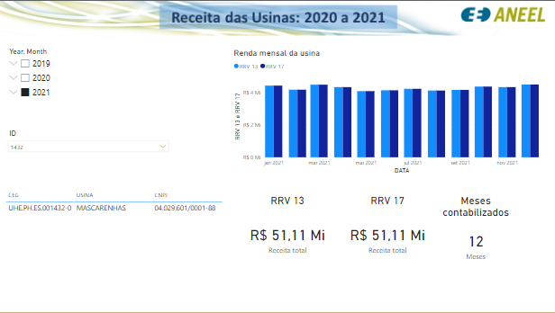

# Relatorio_Faturamento_Usinas
  Criação de relatório em PowerBI de faturamento de usinas de 2020 a 2021 utilizando pandas para tratamento de dados e criação da base para o relatório. 
  Os relatórios de receita são públicos e estão disponíveis em: https://www.ccee.org.br/ Mercado --> Leilões --> Links de Apoio --> Relatórios de Receita

[Acesse o relatório](https://app.powerbi.com/view?r=eyJrIjoiYTZkOTQyYTUtNGE5ZC00ZGMwLWJkNTctMDU1MmMyZjk0MDQwIiwidCI6ImVjMzU5YmExLTYzMGItNGQyYi1iODMzLWM4ZTZkNDhmODA1OSJ9&pageName=ReportSection)
